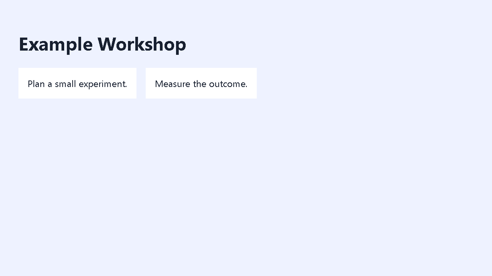

# agent-cortex

Long-term memory and working discipline for coding agents.

An agent's context window is short-term memory. Everything it learned about your
stack dies when the session ends, so you explain the same procedure again next
week. This repo is the part that survives: a single-file memory store, 30
working procedures, four scheduled-job examples and a separately credited
collection of skills by other authors.

The original procedures are extracted from my daily setup with client-specific
material removed. The runnable examples use isolated fixtures rather than live
accounts. Third-party skills stay in their own directory with their upstream
licenses and authors intact.

---

## `cortex.py` — memory that outlives the session

One file, Python standard library, SQLite. Embeddings optional.

```bash
python cortex.py add "Scheduled jobs written as .sh fail silently on Windows: \
the scheduler spawns with a narrow PATH and cannot find bash" --category gotcha

python cortex.py search "my cron job does nothing and reports no error" -n 5
python cortex.py supersede <hash> "the corrected version of that fact"
python cortex.py stats
```

Three decisions make it work, and all three were measured rather than assumed.

**Memory travels as text, never as a binary.** `facts.jsonl` is the source of
truth and goes in git with `merge=union`. The SQLite database and the vectors are
derived and gitignored. A jsonl → db → search roundtrip returns bit-identical
scores, and `UNIQUE(content)` absorbs merge duplicates on its own. This is what
makes syncing across machines safe: a live SQLite file in git corrupts through
its WAL sidecars, but text always rebuilds.

**Embeddings lead the ranking; lexical search is only a tiebreak.** Measured
recall@5 over a 40-query set:

| Ranking | Exact token | Paraphrase | recall@5 |
|---|---|---|---|
| Lexical only (FTS5 bm25) | 100% | 0% | 57% |
| Embeddings only | 100% | 43% | **100%** |
| Naive RRF fusion | 100% | 14% | worse than either |

The fusion row is the interesting one. FTS5 is confidently wrong on paraphrase,
and a rank-based fusion has no way to discount that confidence, so adding a
second signal made the system worse. Lexical now enters only above a 0.85 floor,
as a tiebreak for exact identifiers like `createServiceRoleClient`, at weight
0.15.

**Facts are superseded, never edited.** A wrong fact that was silently rewritten
cannot be audited, and it returns through the next sync. `supersede` keeps the
old row, marks it, and points it at the replacement.

There is also a lesson in what the ranking *does not* do: the machine a fact came
from is a weak tiebreak, worth −0.02, and never a filter. At a 0.55 multiplier,
the correct fact for a query fell 54 positions. The cause is conceptual: the
device field records *where a path exists*, not where the knowledge matters. Only
absolute paths are genuinely machine-specific.

Without `fastembed` and `numpy` installed, search degrades to lexical and says
so. It never crashes for a missing optional dependency.

---

## `skills/` — 30 procedures

Markdown documents, readable by a human and loadable by any agent that supports
skill files. They encode the checks, not the happy path.

### Verification and judgement

| Skill | What it is for |
|---|---|
| [`measurement-validity`](skills/measurement-validity) | Before trusting a number that will drive a decision, check the instrument that produced it. |
| [`recall-and-claim-verification`](skills/recall-and-claim-verification) | Asked to resupply something you produced before? Verify it still exists and still says that, rather than recalling it. |
| [`delegated-agent-supervision`](skills/delegated-agent-supervision) | Supervising a dispatched agent: fence the scope, then verify against the tree instead of the agent's report. |
| [`worktree-analysis`](skills/worktree-analysis) | Read a long-dirty tree, cluster it by time and authorship, and decide *whether* each cluster deserves a commit at all. Ships a forensics script. |
| [`commit-work`](skills/commit-work) | Turn a dirty tree into clean commits written in the voice that repo's log already speaks, learned from the log each run. |

### Delegation and parallel work

| Skill | What it is for |
|---|---|
| [`delegate-coding-task`](skills/delegate-coding-task) | Fence a coding task before handing it over: allowed files, forbidden files, and an explicit order to stop outside the fence. |
| [`parallel-agent-fanout`](skills/parallel-agent-fanout) | Fan one job out to several concurrent agents on a single repo without them overwriting each other. |
| [`agent-config-sync`](skills/agent-config-sync) | Share hooks and scheduled jobs between machines without a pull on one silently breaking the other. |

### Deployment and infrastructure

| Skill | What it is for |
|---|---|
| [`static-site-vps-deploy`](skills/static-site-vps-deploy) | Ship a static site to nginx on a VPS, with a backup and a smoke test that actually loads the page. |
| [`github-pages-deploy`](skills/github-pages-deploy) | Publish a static site or client-side game to GitHub Pages, including the path traps. |
| [`domain-dns-cutover`](skills/domain-dns-cutover) | Move a domain to new hosting and verify at the authoritative nameserver, not at your resolver's cache. |
| [`custom-domain-email`](skills/custom-domain-email) | Own-domain email: SPF, DKIM, DMARC, and diagnosing why mail lands in spam. |
| [`supabase-auth-debugging`](skills/supabase-auth-debugging) | Login, OAuth and email-link failures, diagnosed by symptom rather than by guesswork. |

### Windows

| Skill | What it is for |
|---|---|
| [`windows-background-process-hygiene`](skills/windows-background-process-hygiene) | Console windows flashing on your desktop: find the real spawn chain and make it windowless. Includes the debugging narrative, wrong first hypothesis included. |
| [`windows-performance-tuning`](skills/windows-performance-tuning) | A slow Windows box, tuned along the whole latency chain instead of one setting. |

### Frontend, design and stakeholders

| Skill | What it is for |
|---|---|
| [`frontend-render-performance`](skills/frontend-render-performance) | A UI that gets slower the longer it runs: find the O(n) work hiding in an event handler. |
| [`brand-retrofit`](skills/brand-retrofit) | Apply a brand to code that already exists, without a rewrite and without a screenshot lying to you. |
| [`clickable-concept-prototype`](skills/clickable-concept-prototype) | A clickable phone-frame HTML mockup, built to get a decision out of a non-technical stakeholder. |
| [`stakeholder-decision-elicitation`](skills/stakeholder-decision-elicitation) | Get an actual decision from a non-technical owner over chat, instead of another "looks good". |

### Getting started and reading code

| Skill | What it is for |
|---|---|
| [`first-run-onboarding`](skills/first-run-onboarding) | A non-technical person's first Hermes session: safe defaults, the two honesty skills, and a six-question interview saved to memory so the next conversation starts knowing them. |
| [`new-project-scaffolding`](skills/new-project-scaffolding) | Start a new project inheriting the conventions the rest of your work already uses. |
| [`codebase-inspection`](skills/codebase-inspection) | Size up an unfamiliar codebase: lines, languages, test-to-source ratio. |
| [`blocked-page-recovery`](skills/blocked-page-recovery) | A fetch that returns 403, 429, a paywall or a bot wall, and what to try in what order. |

### Runnable verification examples

| Skill | Decision and observed check |
|---|---|
| [`delivery-verification`](skills/delivery-verification) | A completed checklist must cover the stated acceptance criteria. Two fixture tests cover accepted and refused records; a recorded claim still needs independent evidence. |
| [`isolated-worktree-testing`](skills/isolated-worktree-testing) | Capture staged and unstaged changes before creating the test worktree. Four tests verify source preservation and refusal of untracked files, submodules and an existing target. |
| [`agent-branch-integration`](skills/agent-branch-integration) | Check ancestry without merging or pushing. Three disposable-repository tests pass; ancestry alone does not establish compatibility. |
| [`contrastive-refactor-demo`](skills/contrastive-refactor-demo) | Compare the same four inputs before and after. The fixture has one failure before and zero after; a deliberately regressed implementation makes the audit fail. |
| [`multi-layout-preview`](skills/multi-layout-preview) | Render both layouts and check the browser console and marked text containers. Both fixtures pass; injected console errors and clipping each fail. Requires optional Playwright and Chromium. |
| [`windows-desktop-automation`](skills/windows-desktop-automation) | Test the native argument boundary rather than trusting a command string. Thirteen PowerShell argv round-trips and four stubbed focus scenarios pass without controlling a real desktop window. |
| [`single-source-training-materials`](skills/single-source-training-materials) | Generate slides, summary and quiz from one authored fixture. Self-test verifies shared-source updates, escaping and rejection of three invalid inputs. |

These checks ran locally on Windows with Python 3.12.10. They establish the
fixture behavior, not production readiness, cross-platform coverage or a
performance benchmark. Each directory contains its commands and limitations.

A real screenshot from the two-layout fixture check:



The thread running through all of them: **an agent's closing message is a
self-report, not evidence.** "Implemented and tested" routinely means one file
written and nothing run. Every skill ends with a verification section naming the
command whose real output would prove the claim.

## `crons/` — scheduled-job examples

These are standalone local examples, not exports of an active scheduler. Every
scheduler recipe is disabled by default; nothing registers or runs a job for you.

| Example | Failure the example prevents |
|---|---|
| [`conflict-aware-git-sync`](crons/conflict-aware-git-sync) | A conflict silently overwriting local work, or a sync committing someone else's staged files. Only explicit owned paths may be committed; there is no push operation. |
| [`change-gated-monitor`](crons/change-gated-monitor) | An assistant waking itself again after replying, or losing its baseline during an outage. The wake identity tracks requests, not replies. |
| [`approval-aware-retry`](crons/approval-aware-retry) | A human approval gate turning into permission merely because time passed. Operational retries have a cooldown and limit; processing is simulated locally. |
| [`durable-follow-up`](crons/durable-follow-up) | An unresolved obligation disappearing when it ages out of a rolling scan window. Explicit evidence resolves it; replay-safe state retains the decision. |

All 19 tests pass, including CLI lifecycles and disposable local Git remotes.
State assumes one writer. Output on stdout is not a delivered notification;
connecting a real scheduler or destination is a separate, explicit operation.

## Useful skills by other authors

These are curated upstream copies, **not my work**. They are kept separate from
`skills/`, pinned to specific commits and retain their original notices. Read the
[usage guide](third_party/README.md), [licenses and attribution](THIRD_PARTY_NOTICES.md)
and [per-file provenance](third_party/manifest.json) before reuse.

| Skill | Author / maintainer | Why it is included | License |
|---|---|---|---|
| [Ponytail](third_party/ponytail/SKILL.md) | [DietrichGebert](https://github.com/DietrichGebert/ponytail) | Prefer the smallest working solution without skipping root-cause investigation or verification. | MIT |
| [Caveman](third_party/caveman/SKILL.md) | [Julius Brussee](https://github.com/JuliusBrussee/caveman) | Reduce explanatory padding while preserving technical details. Base prose skill only; modes, hooks and runtime are not bundled. | Apache-2.0 |
| [ML Paper Writing](third_party/ml-paper-writing/SKILL.md) | [Orchestra Research](https://github.com/orchestra-research/AI-Research-SKILLs) | Structure papers around actual results and checked literature. Includes five research references; conference templates and companion skills must be obtained separately. | MIT |
| [Grounded Citations](third_party/grounded-citations/SKILL.md) | Hermes Agent + Teknium, [Nous Research](https://github.com/NousResearch/hermes-agent) | Keep a source ledger and reject missing quotation evidence. Includes standalone standard-library scripts; retrieval tools are not bundled. | MIT |

Twenty-one upstream files match their pinned remote SHA-256 hashes. The bundled
citation scripts pass lifecycle, invalid-evidence and standalone fallback checks.
The other three skills are prose; these checks do not reproduce their upstream
benchmark claims or establish agent-specific command support.

---

## Install

```bash
git clone https://github.com/Rafaelrr5/agent-cortex
cd agent-cortex
python cortex.py stats                 # works immediately, lexical search
pip install fastembed numpy            # optional: upgrades search to semantic
python cortex.py rebuild               # embeds what is already stored
```

`CORTEX_HOME` (default `~/.cortex`) decides where `facts.jsonl` and the database
live. Point it at a git repo if you want memory to sync between machines, and set
`merge=union` on `facts.jsonl` in `.gitattributes`.

Skills: copy only the folders you want into your agent's documented skill search
path. Markdown instructions are readable without installing this repo. Some
procedures include Python helpers or optional browser tools; their own docs state
the requirements. Keep third-party LICENSE and NOTICE files with copied skills.
No installer changes your active profile or registers scheduled jobs.

---

## Articles

Short pieces on working with agents, each anchored to something in this repo you
can read and run. Full index in [`articles/`](articles).

| Article | The question it answers |
|---|---|
| [Implemented and tested is not evidence](articles/implemented-and-tested-is-not-evidence.md) | Why an agent's closing summary cannot be trusted, and what to read instead |
| [Why your agent forgets everything](articles/why-your-agent-forgets-everything.md) | Why every session starts from zero, and what a memory store has to get right |
| [Five agents, one repo](articles/five-agents-one-repo.md) | Running concurrent agents on one codebase without them overwriting each other |
| [Why brand skills matter more than brand guidelines](articles/why-brand-skills-matter.md) | The business argument for executable brand rules: review cost, not aesthetics |

## Scope

Extracted from a setup I run daily, with everything tied to an employer, a client
or a private project removed. What is left is the part that generalises.

Issues and PRs welcome, particularly measurements that contradict the table
above. The ranking decisions here were made by running the queries, and should be
revised the same way.

Original material is MIT. Third-party works retain the licenses listed in
[THIRD_PARTY_NOTICES.md](THIRD_PARTY_NOTICES.md), including Caveman's Apache-2.0
license. The root MIT license does not relicense those works.
